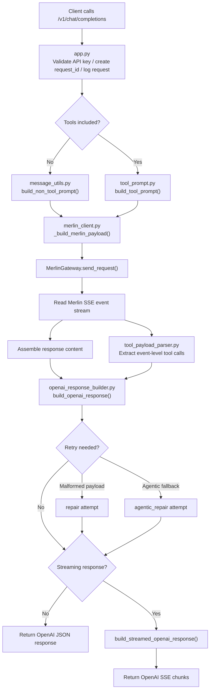

# Architecture Flow

This project accepts OpenAI-compatible chat requests, forwards them to Merlin, and converts Merlin output back into OpenAI-compatible responses.

Primary endpoints:

- `POST /v1/chat/completions`
- `GET /v1/models`

For setup and day-to-day usage, start with the [root README](../README.md). This document focuses on internal request flow and module boundaries.

## High-Level Flow

1. A client sends a request to `POST /v1/chat/completions`.
2. `app.py` validates the adapter API key, creates a `request_id`, and logs request metadata.
3. The adapter determines whether the request is a regular chat flow or a tool-calling flow.
4. `merlin_client.py` builds the Merlin payload and sends the upstream request.
5. Merlin returns an SSE event stream.
6. The adapter assembles content, extracts usable tool calls, and resolves any structured payload blocks.
7. `openai_response_builder.py` constructs the final OpenAI-style response.
8. If needed, the adapter performs a `repair` or `agentic_repair` retry.
9. The response is returned as either standard JSON or an OpenAI-style streaming response.

## Request Flow Diagram

## Module Responsibilities

### `merlinai_adapter_server/app.py`

Responsibilities:

- FastAPI application entrypoint
- API key validation
- `request_id` creation
- Request and response debug logging
- `/v1/models` exposure
- Threadpool dispatch for the synchronous Merlin client

Main endpoints:

- `/v1/chat/completions`
- `/v1/models`

### `merlinai_adapter_server/merlin_client.py`

Responsibilities:

- Build Merlin HTTP payloads
- Send upstream requests
- Read Merlin SSE streams
- Assemble response content
- Extract event-level tool call information
- Run `repair` and `agentic_repair` when needed

Key areas:

- `MerlinGateway.build_payload()`
- `MerlinGateway.send_request()`
- `MerlinOpenAIClient.execute_chat_completion()`
- `MerlinOpenAIClient._should_retry_agentic_tool_call()`

### `merlinai_adapter_server/message_utils.py`

Responsibilities:

- Extract text from OpenAI-style messages
- Serialize system, user, assistant, and tool history
- Split system messages into platform and user layers
- Sanitize older structured tool blocks into safer summaries
- Build non-tool prompt sections

Key areas:

- `extract_message_text()`
- `build_prompt_message_sections()`
- `build_prompt_message_sections_json()`
- `build_non_tool_prompt()`

### `merlinai_adapter_server/tool_prompt.py`

Responsibilities:

- Normalize `tool_choice`
- Decide when to force strict tool JSON mode
- Build the tool prompt sent to Merlin
- Preserve tool schema in `Available Tools JSON`
- Define retry behavior for failed tool responses

Key areas:

- `normalize_tool_choice()`
- `should_force_tool_json()`
- `compact_tools_for_prompt()`
- `build_tool_prompt()`
- `should_retry_tool_response()`

### `merlinai_adapter_server/tool_payload_parser.py`

Responsibilities:

- Parse `<OPENAI_TOOL_PAYLOAD>...</OPENAI_TOOL_PAYLOAD>` blocks
- Attempt JSON repair on malformed payloads
- Extract tool calls from Merlin events or payload blocks
- Enforce allow-list filtering for tool calls
- Resolve whether the result should be treated as `message` or `tool_calls`

Key areas:

- `extract_structured_payload_blocks()`
- `try_parse_payload_candidates()`
- `extract_tool_calls()`
- `extract_tool_calls_from_json_payload()`
- `resolve_payload_result()`

### `merlinai_adapter_server/openai_response_builder.py`

Responsibilities:

- Decide whether the final response should be plain content or `tool_calls`
- Enforce `required` and named-function tool-calling rules
- Build standard OpenAI-style responses
- Build streaming OpenAI-style responses

Key areas:

- `build_openai_response()`
- `build_streamed_openai_response()`
- `_validate_response_mode()`

### `merlinai_adapter_server/request_logging.py`

Responsibilities:

- Store `request_id` and `attempt` in `ContextVar`
- Ensure all debug logs from a request share the same correlation metadata

### `merlinai_adapter_server/logging_config.py`

Responsibilities:

- Configure console and file logging
- Emit full JSON debug payloads in `DEBUG`
- Inject `request_id` and `attempt` into log bodies

### `merlinai_adapter_server/models_catalog.py`

Responsibilities:

- Define the externally published model list
- Build the OpenAI-style response returned by `/v1/models`

## Standard Chat Flow

1. `app.py` accepts the request, validates the adapter API key, and creates a `request_id`.
2. `message_utils.py` builds a structured non-tool prompt.
3. `merlin_client.py` builds the Merlin payload and sends the request.
4. Merlin returns SSE events.
5. `merlin_client.py` assembles response content from the event stream.
6. `openai_response_builder.py` returns an OpenAI-style assistant message.

## Tool-Calling Flow

1. `app.py` receives a request containing `tools`.
2. `merlin_client.py` sends the request with `metadata.mcpConfig.isEnabled = false`.
3. `merlin_client.py` also forces `metadata.webAccess = true`.
4. `tool_prompt.py` builds a stricter prompt with tool schema preserved in JSON.
5. Merlin may respond with event-level tool calls, structured payload blocks, or plain text.
6. `tool_payload_parser.py` extracts tool call data from the response.
7. `openai_response_builder.py` decides whether to return `message.tool_calls`, plain assistant content, or `422`.
8. If the structured payload is malformed, the adapter can retry with `repair`.
9. If `tool_choice=auto` appears to stop early in a multi-step tool flow, the adapter can retry with `agentic_repair`.

## Logging and Correlation

When `LOG_LEVEL=DEBUG`, the main logs include:

- `incoming_chat_request`
- `tool_prompt_metrics`
- `non_tool_prompt_metrics`
- `outgoing_merlin_payload`
- `merlin_raw_response`
- `merlin_attempt_summary`
- `structured_payload_resolution`
- `agentic_repair_skipped`
- `outgoing_openai_response`
- `streamed_openai_response_summary`

Each debug payload includes the same `request_id`, and retries also carry an `attempt` value. That makes it possible to trace a single request across `initial`, `repair`, and `agentic_repair` phases.

## Related Docs

- [API reference](api-reference.md)
- [Project README](../README.md)
- [Traditional Chinese README](../README.zh-TW.md)
- [Development notes](development-notes.md)
- [Troubleshooting](troubleshooting.md)
