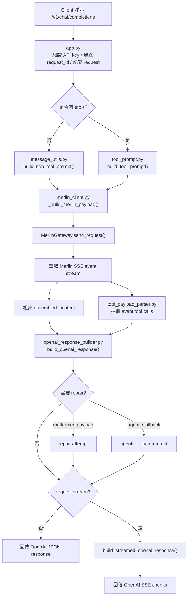

# Merlin Adapter 流程說明

## 這個專案在做什麼

這個專案接收 OpenAI 相容格式的聊天請求，轉送到 Merlin，然後再把 Merlin 的回應轉回 OpenAI API 相容格式。

目前提供兩個主要端點：

- `POST /v1/chat/completions`
- `GET /v1/models`

## 高階流程

1. Client 呼叫 `POST /v1/chat/completions`
2. [`app.py`](../merlinai_adapter_server/app.py) 驗證 API key，建立 `request_id`，並記錄 request
3. 系統判斷這次請求是不是 tool-calling 模式
4. [`merlin_client.py`](../merlinai_adapter_server/merlin_client.py) 建立要送給 Merlin 的 payload
5. Merlin 回傳 SSE event stream
6. 系統組出 `assembled_content`、抽取可用的 tool calls、解析 structured payload
7. [`openai_response_builder.py`](../merlinai_adapter_server/openai_response_builder.py) 組成 OpenAI 相容回應
8. 若需要，走一次 `repair` 或 `agentic_repair`
9. 回傳：
   - 一般 JSON 回應
   - 或 OpenAI chunk streaming 回應

## 流程圖

## 各模組責任

### [`app.py`](../merlinai_adapter_server/app.py)

職責：

- FastAPI 入口
- 驗證 `Authorization`
- 建立 `request_id`
- 使用 `run_in_threadpool(...)` 執行同步 Merlin client，避免阻塞 event loop
- 記錄 request / response debug 資訊
- 提供 `/v1/models`

重點：

- `/v1/chat/completions`
- `/v1/models`

### [`merlin_client.py`](../merlinai_adapter_server/merlin_client.py)

職責：

- 建立 Merlin HTTP payload
- 發送 HTTP request 到 Merlin
- 讀取 Merlin SSE stream
- 抽出 `assembled_content` 與 event-level tool calls
- 在需要時執行 `repair` 與 `agentic_repair`

重點：

- `MerlinGateway.build_payload()`
- `MerlinGateway.send_request()`
- `MerlinOpenAIClient.execute_chat_completion()`
- `MerlinOpenAIClient._should_retry_agentic_tool_call()`

### [`message_utils.py`](../merlinai_adapter_server/message_utils.py)

職責：

- 從 OpenAI `messages` 抽出純文字
- 序列化 `system / user / assistant / tool` 歷史訊息
- 將 system messages 拆成 platform / user 兩層
- 將 `tool` content 中舊的 structured payload block 轉成較安全的摘要結構
- 建立 non-tool prompt 所需的 message sections

重點：

- `extract_message_text()`
- `build_prompt_message_sections()`
- `build_prompt_message_sections_json()`
- `build_non_tool_prompt()`

### [`tool_prompt.py`](../merlinai_adapter_server/tool_prompt.py)

職責：

- 判斷是否要強制走 tool JSON 模式
- 正規化 `tool_choice`
- 建立真正送給 Merlin 的 tool prompt
- 保留完整工具 schema 進 `Available Tools JSON`
- 建立 `repair` / `strict` 模式下的 prompt 指令
- 判斷 tool mode 失敗時是否值得 retry

重點：

- `normalize_tool_choice()`
- `should_force_tool_json()`
- `compact_tools_for_prompt()`
- `build_tool_prompt()`
- `should_retry_tool_response()`

### [`tool_payload_parser.py`](../merlinai_adapter_server/tool_payload_parser.py)

職責：

- 解析 `<OPENAI_TOOL_PAYLOAD>...</OPENAI_TOOL_PAYLOAD>` 區塊
- 嘗試修復壞掉的 JSON
- 從 Merlin event 或 payload block 抽出 tool calls
- 過濾不在 allow-list 裡的 tool call
- 決定 payload 應該視為 `message` 還是 `tool_calls`

重點：

- `extract_structured_payload_blocks()`
- `try_parse_payload_candidates()`
- `extract_tool_calls()`
- `extract_tool_calls_from_json_payload()`
- `resolve_payload_result()`

### [`openai_response_builder.py`](../merlinai_adapter_server/openai_response_builder.py)

職責：

- 決定最後回應應該是 `content` message 還是 `tool_calls`
- 驗證 `required` / `function:...` 這類 tool-calling 規則有沒有被滿足
- 建立 OpenAI 非串流回應
- 建立 OpenAI 串流回應

重點：

- `build_openai_response()`
- `build_streamed_openai_response()`
- `_validate_response_mode()`

### [`request_logging.py`](../merlinai_adapter_server/request_logging.py)

職責：

- 透過 `ContextVar` 保存 `request_id` 與 `attempt`
- 讓 debug log 自動帶上相同的關聯資訊

### [`logging_config.py`](../merlinai_adapter_server/logging_config.py)

職責：

- 初始化 console / file logging
- 在 `DEBUG` 下輸出完整 JSON payload
- 自動把 `request_id` / `attempt` 注入到 log body

### [`models_catalog.py`](../merlinai_adapter_server/models_catalog.py)

職責：

- 定義 proxy 對外宣告的模型清單
- 組出 `/v1/models` 的 OpenAI 相容回應

## 詳細流程

### A. 一般聊天請求

1. [`app.py`](../merlinai_adapter_server/app.py) 收到 request，驗證 API key，建立 `request_id`
2. [`message_utils.py`](../merlinai_adapter_server/message_utils.py) 用 `build_non_tool_prompt()` 組出結構化 prompt
3. [`merlin_client.py`](../merlinai_adapter_server/merlin_client.py) 建立 Merlin payload
4. Merlin 回傳 SSE events
5. [`merlin_client.py`](../merlinai_adapter_server/merlin_client.py) 組出 `assembled_content`
6. [`openai_response_builder.py`](../merlinai_adapter_server/openai_response_builder.py) 轉成 OpenAI assistant message

### B. Tool-calling 請求

1. [`app.py`](../merlinai_adapter_server/app.py) 偵測到 `request.tools`
2. [`merlin_client.py`](../merlinai_adapter_server/merlin_client.py) 固定將：
   - `metadata.mcpConfig.isEnabled = false`
   - `metadata.webAccess = true`
3. [`tool_prompt.py`](../merlinai_adapter_server/tool_prompt.py) 建立嚴格的 tool prompt
4. prompt 會保留：
   - `Platform System Messages JSON`
   - `User System Messages JSON`
   - `Conversation Messages JSON`
   - `Available Tools JSON`
5. Merlin 可能回傳：
   - event stream 中的 tool calls
   - payload block 內的結構化 JSON
   - 一般純文字
6. [`tool_payload_parser.py`](../merlinai_adapter_server/tool_payload_parser.py) 把可用的 tool 資訊抽出來
7. [`openai_response_builder.py`](../merlinai_adapter_server/openai_response_builder.py) 決定最後應回：
   - `message.tool_calls`
   - 一般 assistant `message.content`
   - 或 `422`
8. 若上游 structured payload 非法，走一次 `repair`
9. 若在 `tool_choice=auto` 的多步工具流程中，模型提前回成一般 `message`，可能再走一次 `agentic_repair`

## Logging 與除錯

開啟 `LOG_LEVEL=DEBUG` 時，主要可觀察這些 log：

- `incoming_chat_request`
- `tool_prompt_metrics`
- `non_tool_prompt_metrics`
- `outgoing_merlin_payload`
- `merlin_raw_response`
- `merlin_attempt_summary`
- `structured_payload_resolution`
- `agentic_repair_skipped`
- `outgoing_openai_response`
- `streamed_openai_response_summary`

所有 debug payload 都會帶相同的 `request_id`，若是 retry 也會標示 `attempt`，方便把同一筆請求的 `initial / repair / agentic_repair` 串起來。

## 遇到問題時該看哪裡

### tool prompt 不對

看：

- [`tool_prompt.py`](../merlinai_adapter_server/tool_prompt.py)
- [`message_utils.py`](../merlinai_adapter_server/message_utils.py)

### Merlin event 解析不對

看：

- [`merlin_client.py`](../merlinai_adapter_server/merlin_client.py)
- [`tool_payload_parser.py`](../merlinai_adapter_server/tool_payload_parser.py)

### OpenAI 回應格式不對

看：

- [`openai_response_builder.py`](../merlinai_adapter_server/openai_response_builder.py)

### request / attempt 對帳不清楚

看：

- [`request_logging.py`](../merlinai_adapter_server/request_logging.py)
- [`logging_config.py`](../merlinai_adapter_server/logging_config.py)

## 補充

- 舊的 `openai_adapter.py` 已移除，因為它只是轉手 export，沒有實際邏輯。
- 舊的 `merlin_protocol.py` 已拆掉，避免 prompt、parser、response builder 全部混在同一檔。
- 現在如果你要調整某一段行為，比較容易定位責任模組，不用在單一大檔裡來回找。
