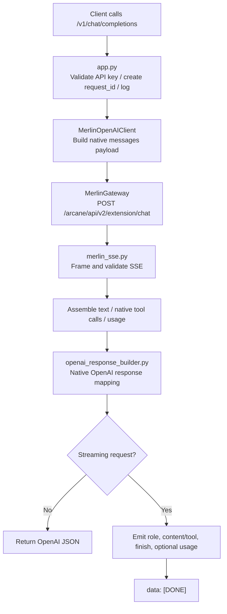

# Architecture Flow

This project accepts OpenAI-compatible chat requests, forwards the native
message sequence to Merlin's extension chat endpoint, and converts Merlin's
SSE events back into OpenAI-compatible responses.

Primary endpoints:

- `POST /v1/chat/completions`
- `GET /v1/models`

For setup and day-to-day usage, start with the [root README](../README.md).
This document describes the current extension transport and module
boundaries. The old prompt-compaction helpers are legacy diagnostics only and
are not part of the normal request path.

The flow below describes `TOOL_CALL_MODE=native`, the program default.
`TOOL_CALL_MODE=emulated` uses the same extension gateway and SSE parser, but
encodes tool schemas/history as text and validates a buffered protocol response.
See [emulated tool calling](emulated-tool-calling.md) for that flow and its limits.

## High-Level Flow (native mode)

1. A client sends a request to `POST /v1/chat/completions`.
2. `app.py` validates the adapter API key, creates a `request_id`, and logs
   request metadata.
3. `merlin_client.py` preserves the message sequence, converts string content
   in `user` and `tool` messages into native text parts, and builds
   `{model,messages,params,metadata}`.
4. Request validation resolves `tool_choice` before network I/O: omitted or
   `null` and `auto` forward caller tools, literal `none` uses `tools=[]`, and unverified
   required/named/invalid selectors return `422`.
5. `MerlinGateway` sends the request to `/arcane/api/v2/extension/chat` with
   the configured `x-merlin-version` and extension Origin headers.
6. `merlin_sse.py` frames the response by blank lines, validates JSON events,
   and requires an explicit `DONE`; upstream error events and incomplete EOFs
   fail the request.
7. `merlin_client.py` assembles text, native tool events, and usage counters.
8. `openai_response_builder.py` maps those values to an OpenAI response or
   stream chunks.
9. The response is returned as standard JSON or an OpenAI-style SSE stream.

The adapter does not register Merlin's browser or MCP tools. `params.tools`
is empty unless an OpenAI caller explicitly supplies function schemas. The
`metadata.isMCPEnabled=true` field is the extension session capability flag
required by the endpoint; it does not add tool definitions.

## Request Flow Diagram

```mermaid
flowchart TD
    A["Client calls /v1/chat/completions"] --> B["app.py<br/>Validate API key / create request_id / log"]
    B --> C["MerlinOpenAIClient<br/>Build native messages payload"]
    C --> D["MerlinGateway<br/>POST /arcane/api/v2/extension/chat"]
    D --> E["merlin_sse.py<br/>Frame and validate SSE"]
    E --> F["Assemble text / native tool calls / usage"]
    F --> G["openai_response_builder.py<br/>Native OpenAI response mapping"]
    G --> H{"Streaming request?"}
    H -->|No| I["Return OpenAI JSON"]
    H -->|Yes| J["Emit role, content/tool, finish, optional usage"]
    J --> K["data: [DONE]"]
```

## Module Responsibilities

### `merlinai_adapter_server/app.py`

- FastAPI application entrypoint
- API key validation and `request_id` creation
- Request and response debug logging
- `/v1/models` exposure
- Threadpool dispatch for the synchronous Merlin client

### `merlinai_adapter_server/config.py`

- Loads `MERLIN_VERSION`, `MERLIN_PATH`, and `MERLIN_ORIGIN`
- Provides the extension transport defaults
- Keeps Firebase authentication and adapter settings in one validated model

### `merlinai_adapter_server/merlin_client.py`

- Builds the native extension payload
- Sends authenticated HTTPS requests
- Extracts text, reasoning, native tool events, and usage from SSE events
- Maps non-streaming responses and produces live streaming chunks
- Preserves caller-supplied tools without adding official extension tools;
  live upstream tool behavior remains unverified

Key areas:

- `MerlinGateway.build_payload()`
- `MerlinGateway.iter_event_stream()`
- `MerlinOpenAIClient.execute_chat_completion()`
- `MerlinOpenAIClient.open_chat_completion_stream()`
- `MerlinOpenAIClient._build_merlin_payload()`

### `merlinai_adapter_server/merlin_sse.py`

- Implements blank-line SSE framing and multiline `data:` support
- Handles named events such as `INIT_MESSAGE_CONTENT`, `tool_calls`, and
  `usage`
- Detects upstream error events, malformed data, invalid UTF-8, timeouts, and
  incomplete streams
- Requires a native `DONE` event or `[DONE]` terminator before success

### `merlinai_adapter_server/schemas.py`

- Defines the OpenAI request and response models
- Allows native message metadata and provider-specific content parts to pass
  through
- Validates positive `max_tokens`
- Supports `stream_options.include_usage` for local OpenAI response formatting

### `merlinai_adapter_server/openai_response_builder.py`

- Maps native text and structured tool events to OpenAI response messages
- Maps native token counters to `prompt_tokens`, `completion_tokens`, and
  `total_tokens`
- Emits OpenAI streaming chunks, including the optional usage chunk with
  `choices: []`
- Retains older prompt-based builders as legacy diagnostics; the normal
  extension path uses `build_native_openai_response()` and `build_stream_chunk()`

### `merlinai_adapter_server/structured_output.py`

- Normalizes native tool event objects when the caller supplied matching
  schemas, requiring a non-empty id/name and object arguments
- Filters tool names against the caller's allow-list
- Provides legacy structured-output helpers used by comparison utilities

### `merlinai_adapter_server/tool_prompt.py`, `message_utils.py`, and
`tool_payload_parser.py`

These modules contain the earlier prompt-based tool compatibility path. They
remain historical diagnostics only. The native tool mode does not
flatten messages into a single prompt, inject extra instructions, repair JSON,
or fabricate tool calls from ordinary text. The old comparison CLI is retired
before any upstream network request.

### `merlinai_adapter_server/request_logging.py` and `logging_config.py`

- Keep `request_id` and attempt context in `ContextVar`
- Configure console/file logging and attach correlation metadata
- Record transport, event counts, and response summaries without changing the
  OpenAI API surface

### `merlinai_adapter_server/models_catalog.py`

- Defines the externally published active text model IDs
- Builds the OpenAI-style response returned by `/v1/models`

## Standard Chat Flow

1. `app.py` accepts the request, validates the adapter API key, and creates a
   `request_id`.
2. `ChatCompletionContext` snapshots the model, optional caller tools,
   `max_tokens`, and `stream_options`; the request's message list is passed
   separately to the payload builder unchanged.
3. `_build_merlin_payload()` preserves message metadata and converts user/tool
   strings to native text parts.
4. `MerlinGateway` sends the extension request and `merlin_sse.py` validates
   the complete stream.
5. Native text and usage are assembled.
6. `build_native_openai_response()` returns an OpenAI-style assistant message
   with mapped usage.

## Caller-Supplied Tool Flow (native mode)

1. A caller may include its own OpenAI function schemas in `tools`.
2. The adapter forwards those schemas in `params.tools`; it does not add the
   extension's browser, MCP, or other built-in tools.
3. Omitted or `null` `tool_choice`, and `auto`, forward caller schemas.
   Literal `none` sends no tools. Required, named, and invalid selectors are
   rejected with `422` before network I/O.
4. If Merlin emits a structured native tool event whose name is declared by the
   caller, the adapter maps it to OpenAI `tool_calls` and uses
   `finish_reason=tool_calls`.
5. Native tool events must have `type=function`, a non-empty id/name, valid
   object arguments, and a caller-declared name. Malformed or undeclared
   native tool events fail with `502` (or a streamed
   `event: error` without successful `[DONE]`).
6. Ordinary text that happens to contain JSON is kept as assistant content;
   it is not reinterpreted as a native tool call.
7. The current live smoke command covers text only. Custom tool schemas remain
   an explicitly unverified upstream capability and are not used as a normal
   health check.

## Streaming Flow

These live deltas describe native mode and tool-free chats. Emulated tool rounds
emit role first, then buffer until upstream DONE and full argument validation;
only then are content or calls, finish, optional usage, and DONE emitted.

For `stream=true`, the adapter emits:

1. an initial assistant role chunk;
2. content or native tool-call deltas as events arrive;
3. a final chunk with `finish_reason=stop` or `tool_calls`;
4. an optional usage chunk with `choices: []` when
   `stream_options.include_usage=true` and Merlin supplied usage;
5. `data: [DONE]`.

If Merlin sends an error event or the stream ends before `DONE`, the adapter
emits an OpenAI-style `event: error` and does not emit a successful finish
chunk or `[DONE]`.

## Logging and Correlation

When `LOG_LEVEL=DEBUG`, the main logs include:

- `incoming_chat_request`
- `outgoing_merlin_payload`
- `merlin_raw_response`
- `merlin_attempt_summary`
- `outgoing_openai_response`
- `streamed_openai_response_summary`

Each debug payload includes the same `request_id`. The extension transport
does not perform prompt JSON repair, hidden retries, or agentic retries; a
failed upstream response is surfaced so callers can decide whether to retry.

## Related Docs

- [API reference](api-reference.md)
- [Extension compatibility](extension-compatibility.md)
- [Extension API migration review](extension-api-migration-review.md)
- [Project README](../README.md)
- [Traditional Chinese README](../README.zh-TW.md)
- [Development notes](development-notes.md)
- [Troubleshooting](troubleshooting.md)
